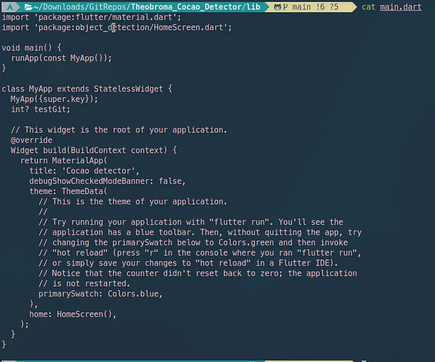
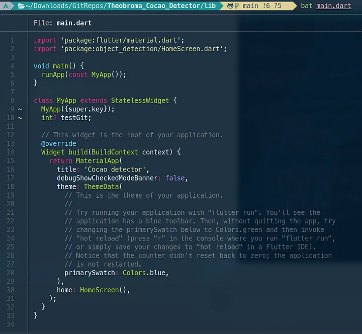

I usually use 'cat' to print readable text in the terminal. But a few days ago, I found a cool tool similar to 'cat' that offers syntax highlighting and git integration. Its name is 'bat'.

I will show you what it looks like. I'll print an uncommitted changed file using both 'cat' and 'bat' to demonstrate their differences.

