The World Health Organization (WHO) reports that 430 million people worldwide are currently deaf or mute. By 2050, this number is projected to exceed 700 million, meaning 1 in 10 people could experience disabling hearing loss. These figures emphasize the critical need to address communication challenges for this population.

Sign Master is an innovative application designed to support the deaf and mute community, their families, and close connections. It addresses key challenges such as the limited resources and limited communication opportunities. By leveraging AI-powered tools for gesture recognition and interactive learning modules, Sign Master enables smooth conversations between deaf individuals and their loved ones, fostering stronger bonds and breaking communication barriers. This ensures the community feels empowered, supported, and included.

The app also caters to two additional groups: individuals learning sign language for personal growth and professionals such as educators or customer service representatives who need it for their careers. With structured modules, gamified quizzes, and certifications, Sign Master makes the learning process engaging and effective. By bridging communication gaps and promoting inclusivity, the app helps foster societal understanding and respect for the deaf community.

This project was developed by a dedicated team of 7 members from Bangkit Academy 2024:
- **Aziz Nur Ashidiq** (Mobile Development)
- **Muhammad Adira Zaidan Putra Pratama** (Mobile Development)
- **Mohammad Fajar Maulid** (Machine Learning)
- **Muhammad Hariish Hafiiz** (Machine Learning)
- **Yazid Rizki Kurniawan** (Machine Learning)
- **Me :D** (Cloud Computing)
- **Rakyan Pangrukti Wibana** (Cloud Computing)

# Core Features

- **AI Gesture Recognition**: Provides a learning tool that allows users to practice signing with instant feedback, helping them improve their sign language skills in real-time.
- **Learning Modules**: Teaches sign language basics, including the alphabet and vocabulary, promoting inclusivity.
- **Gamified Certification**: Engaging quizzes test knowledge and reward certifications to motivate learners.
- **Text-to-Sign Language Gesture Video**: Allows users to translate text into sign language gesture videos, making it easier for them to learn and practice.
- **Sign Language Articles**: Offers a curated collection of insightful articles to deepen users' understanding of sign language and its cultural significance.

[Link Demo](https://drive.google.com/drive/folders/1tAYnIP9UemDs9H7dYSUxSuF4QITxSn4q)

# DATASET LINK

- [WLASL Dataset](https://www.kaggle.com/datasets/waseemnagahhenes/sign-language-dataset-wlasl-videos)
- [ASL Dataset](https://www.kaggle.com/datasets/ayuraj/asl-dataset)

# DEPLOYED LINK

- [Android APK](https://drive.google.com/drive/folders/15nGzLBBbhbpXyFJEK-mNcvSdUSFfDhCc)
- [Auth Service](https://signmaster-auth-kji5w4ybbq-et.a.run.app)
- [ML Inference Service](wss://signmaster-inference-model-kji5w4ybbq-et.a.run.app)
- [Text to Sign Language Service](https://signmaster-tomotion-kji5w4ybbq-et.a.run.app)
- [Learning Material and Quiz Service](https://signmaster-material-quiz-kji5w4ybbq-et.a.run.app)
- [News Service](https://signmaster-news-kji5w4ybbq-et.a.run.app)

[GITHUB REPO LINK](https://github.com/orgs/Bangkit-Capstone-Project-C242-PS363/repositories)

[10-MIN VIDEO PRESENTATION LINK](https://youtu.be/FpDv5hnRYKI)
